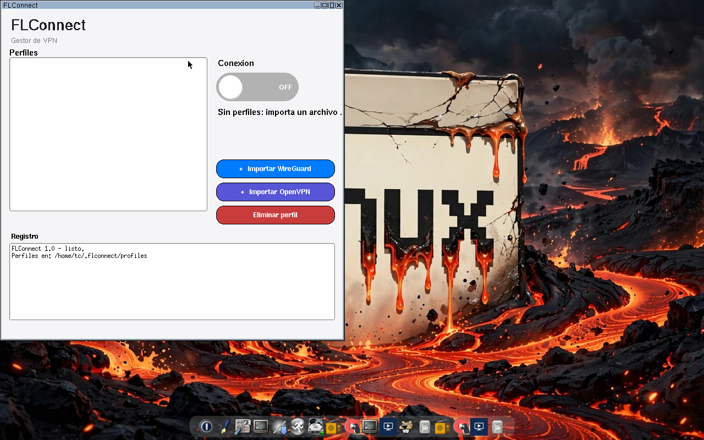
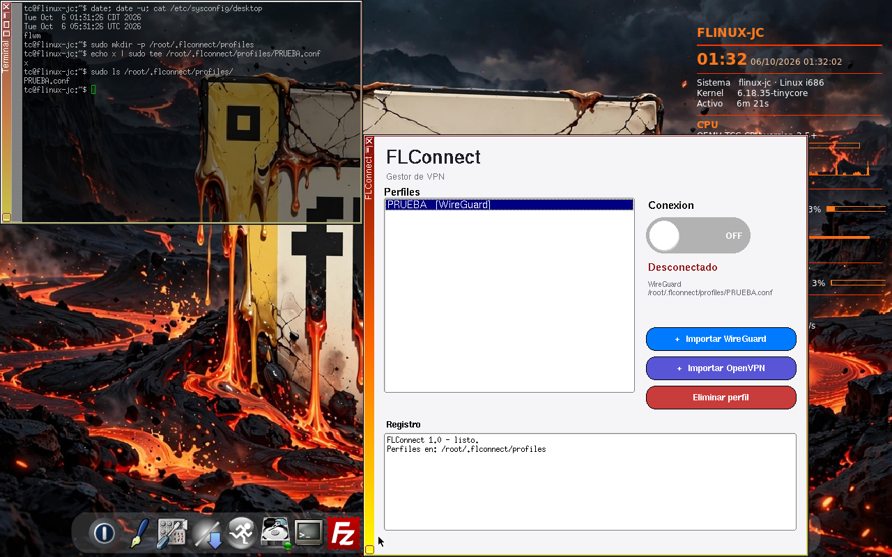
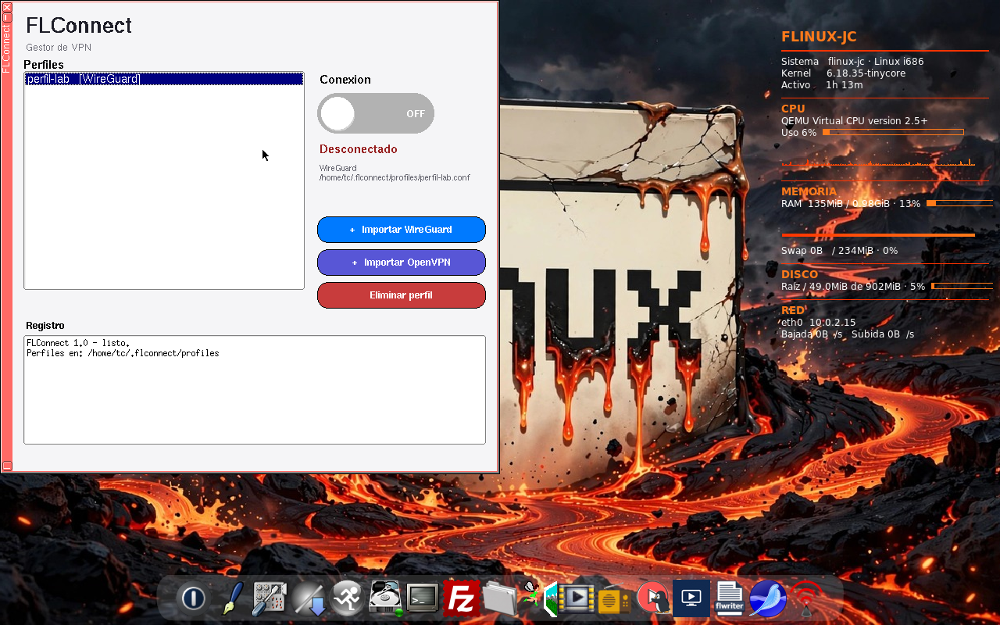

# FLConnect 1.0-4 — Gestor de VPN para Tiny Core Linux (32 bits)

**FLConnect** es un gestor gráfico de VPN para Tiny Core Linux de 32 bits:
importa perfiles **WireGuard** (`.conf`) y **OpenVPN** (`.ovpn`) y los
conecta o desconecta con un interruptor ON/OFF, al estilo de NetworkManager.
Está escrito en C++ con FLTK 1.3 y el paquete es **autocontenido**: trae dentro
todas las herramientas que necesita, así que no depende de ninguna otra
extensión del repositorio.


## Capturas

Ventana principal recién abierta, todavía sin perfiles:



Un perfil WireGuard ya importado y seleccionado (desconectado, interruptor
en OFF); en el detalle se ve su ruta dentro de `/root/.flconnect/profiles/`,
que es donde quedan los perfiles al ejecutarlo con `sudo`:



FLConnect en el escritorio de **FLinux-JC**, con otro perfil WireGuard
seleccionado; cuando la conexión está activa el interruptor se pone en ON
(verde), la fila lleva `*` y el estado pasa a «Conectado»:



## Cómo se usa

1. **Instala** el paquete (ver *Descarga e instalación* más abajo).
2. **Arranca** FLConnect con privilegios de administrador:

   ```
   sudo flconnect
   ```

   La entrada del menú y la del wbar ya lo hacen así
   (`Exec=sudo /usr/local/bin/flconnect`). Debe ser con `sudo` aunque el
   ejecutable lleve setuid root (4755): así el proceso queda con
   `HOME=/root` y ve los perfiles de `/root/.flconnect/profiles/`. Lanzado a
   secas como el usuario `tc`, trabajaría con `HOME=/home/tc` y la lista
   saldría vacía.
3. **Importa** tus perfiles con los botones **Importar WireGuard** (archivo
   `.conf`) e **Importar OpenVPN** (archivo `.ovpn`). Los perfiles quedan
   guardados en `~/.flconnect/profiles/` (con `sudo`,
   `/root/.flconnect/profiles/`), así que siguen ahí la próxima vez que
   abras el programa.
4. **Selecciona un perfil** en la lista y pulsa el **interruptor** para
   conectar (ON) o desconectar (OFF). La salida de cada comando se escribe
   en el panel **Registro**: ahí ves si la conexión subió y, si algo falla,
   el error concreto.
5. Con **Eliminar perfil** borras el perfil seleccionado (y, en OpenVPN,
   también los archivos externos integrados al importarlo).

Notas de uso:

- **Cerrar la ventana no baja una conexión activa**: desconecta siempre
  con el interruptor.
- El estado de cada perfil se refresca solo cada 3 segundos; los perfiles
  conectados se marcan con `*` en la lista.

## Cómo está hecho

- **Interfaz:** un único binario C++ con **FLTK 1.3**. El interruptor es un
  widget propio dibujado a mano (verde en ON, gris en OFF) y la ventana
  incluye la lista de perfiles, el estado y el registro de actividad.
- **WireGuard:** al conectar ejecuta `wg-quick up` sobre el perfil y lo
  verifica con `wg show`; al desconectar, `wg-quick down`. Antes hace
  `modprobe wireguard`, porque la interfaz la crea el **módulo del kernel**;
  si el módulo no puede cargarse, el sistema recurre al respaldo en espacio
  de usuario **wireguard-go**. (En el kernel `6.18.35-tinycore` el módulo
  necesita además `ipv6`: ver *Dependencias del sistema* en la sección de
  instalación.)
- **OpenVPN:** lanza `openvpn --daemon` con el perfil y **comprueba el
  resultado real** leyendo su registro: da la conexión por buena solo
  cuando aparece «Initialization Sequence Completed», y si openvpn muere
  o imprime un error fatal (`AUTH_FAILED`, `TLS Error`,
  `Cannot open TUN/TAP`…) se queda con esa línea y la muestra como causa
  del fallo. Al desconectar termina el demonio por su PID.
- **Credenciales seguras:** si un `.ovpn` pide usuario y contraseña
  (`auth-user-pass` sin archivo), se solicitan al conectar y se escriben
  en un archivo temporal con permisos `0600` que se le pasa a openvpn;
  el archivo **se borra al desconectar** (y también si la conexión falla).
- **Importación estilo NetworkManager:** al importar un `.ovpn`, los
  archivos a los que hace referencia (`ca`, `cert`, `key`, `tls-auth`,
  `tls-crypt`, etc.) se **copian junto al perfil** y las rutas se
  reescriben, de modo que el perfil no se rompe si mueves o borras los
  originales. Los bloques incrustados (`<ca>`, `<key>`…) se conservan tal
  cual.

## Descarga e instalación

### Descarga (Release v1.0-4)

Archivos del Release (el paquete es el mismo que va preinstalado en la ISO
**FLinux-JC v1.5**):

- `flconnect.tcz` — la extensión autocontenida (10 715 136 bytes).
  **MD5:** `04bd082430d22ed7b20fef3213b9833f`
- `flconnect.tcz.md5.txt` — suma MD5 del `.tcz` para comprobar la descarga.
- `flconnect-1.0-4-tinycore32.zip` — los tres archivos juntos (incluye el
  `flconnect.tcz.dep`).
- `flconnect.tcz.dep` — lista de dependencias: **vacía a propósito** (0
  bytes), porque el paquete no depende de ninguna otra extensión del
  repositorio. GitHub no admite adjuntos de 0 bytes en un Release, por eso
  el `.dep` está en la raíz de este repositorio y dentro del ZIP.

### Instalación en Tiny Core 17.1 x86 (32 bits)

1. Copia los tres archivos a tu directorio de extensiones, p. ej.
   `/mnt/sda1/tce/optional/`.
2. Instala sin descargar nada más (todo va dentro del paquete):

   ```
   tce-load -i flconnect.tcz
   ```

3. Ejecuta `sudo flconnect` (ver el paso 2 de *Cómo se usa*). Aparece
   también en el menú de aplicaciones del escritorio.

> **Nota (si instalas en un Tiny Core ya arrancado):** la primera conexión
> de un perfil con DNS puede fallar con `resolvconf: signature mismatch:
> /etc/resolv.conf`, porque el `resolv.conf` que escribió el DHCP no lleva
> la firma de resolvconf (el paquete aún no estaba instalado al arrancar).
> Se corrige una sola vez ejecutando `sudo resolvconf -u` y renovando el
> DHCP; después conecta sin problema. En sistemas donde el paquete ya está
> desde el arranque (como la ISO flinux-jc) esto no ocurre.

### El paquete por dentro (por eso el `.dep` va vacío)

- El binario `flconnect` 1.0-4 (i686, setuid root).
- Herramientas bajo `/usr/local`: `wg` y `wg-quick` (wireguard-tools),
  `wireguard-go` (respaldo en espacio de usuario), `ip` (iproute2),
  `openvpn` 2.6.x, `resolvconf` (openresolv) y `bash`.
- Todas las librerías necesarias (FLTK 1.3, X11, OpenSSL, etc.).
- Firmware Broadcom b43 (incluido el LP-PHY `ucode15.fw`) en
  `/lib/firmware` y `/usr/local/lib/firmware`.
- Entrada de menú `flconnect.desktop` e icono.

### Dependencias del sistema (para que WireGuard conecte sin errores)

El paquete es autocontenido, pero WireGuard usa el módulo del kernel, y en
el kernel `6.18.35-tinycore` eso tiene tres requisitos del sistema:

1. **Módulos `ipv6` + `wireguard`.** El kernel va sin IPv6 y `wireguard.ko`
   necesita los símbolos `ipv6_mod_enabled` / `ipv6_chk_addr`; sin el
   módulo `ipv6` cargado, `modprobe wireguard` falla con «unknown symbol in
   module» y FLConnect cae al respaldo `wireguard-go`. Solución (repo
   FLinux):

   ```
   tce-load -wi ipv6-netfilter-6.18.35-tinycore.tcz
   sudo modprobe ipv6
   sudo modprobe wireguard
   ```

   Para que quede automático en cada arranque, añade esas dos líneas de
   `modprobe` a `/opt/bootsync.sh`.

2. **`coreutils.tcz`** — aporta el comando `stat`, que `wg-quick` llama al
   revisar los permisos del `.conf`. Sin él verás «stat: command not
   found» en el registro (la conexión seguiría, pero con ruido y un
   aviso).

   ```
   tce-load -wi coreutils.tcz
   ```

3. **`nftables.tcz`** — los perfiles de túnel completo (`AllowedIPs =
   0.0.0.0/0`) fijan reglas con `nft`. Los módulos clásicos de iptables
   (`x_tables`, `ip_tables`) no existen en este kernel, así que hace falta
   nft:

   ```
   tce-load -wi nftables.tcz
   sudo modprobe nf_tables
   ```

   (FLConnect ya hace `modprobe wireguard` antes de conectar, pero el
   módulo solo cargará si `ipv6` está presente.)

Para OpenVPN basta el dispositivo `/dev/net/tun`, incluido en el kernel.

> En la ISO **flinux-jc** (v1.4+) todo esto ya viene instalado y cargado
> desde el arranque; estos pasos son para quien instale el `.tcz` suelto
> en un Tiny Core 17.1.

### Compilar desde el código fuente

Necesitas FLTK 1.3 y compilador con soporte 32 bits:

```
g++ -m32 -march=i686 $(fltk-config --cxxflags) -O2 -o flconnect flconnect.cpp $(fltk-config --ldflags)
```

## Licencia

GPL-3.0. Software libre: úsalo, cópialo y modifícalo bajo los términos de
la licencia (ver el archivo `LICENSE`).
